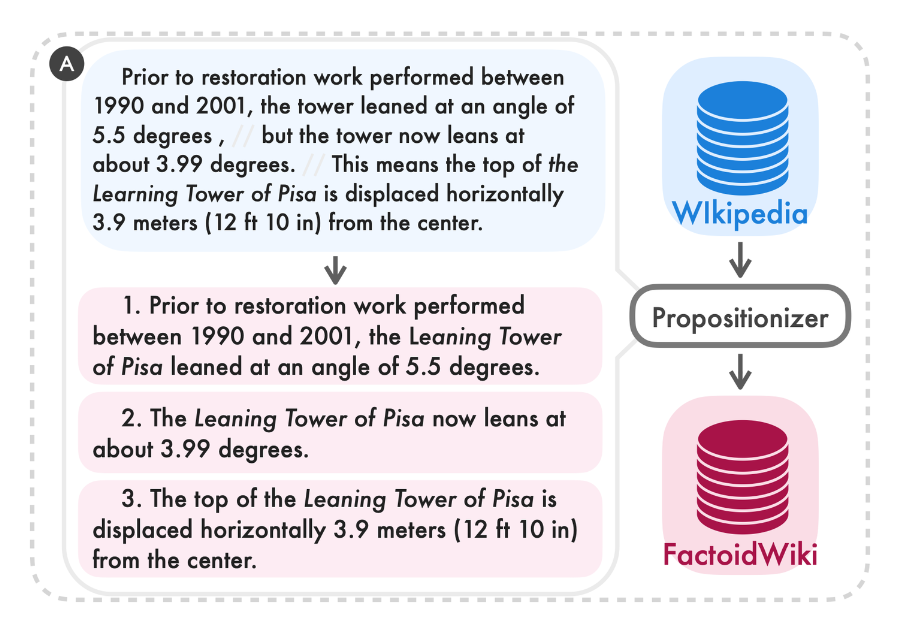
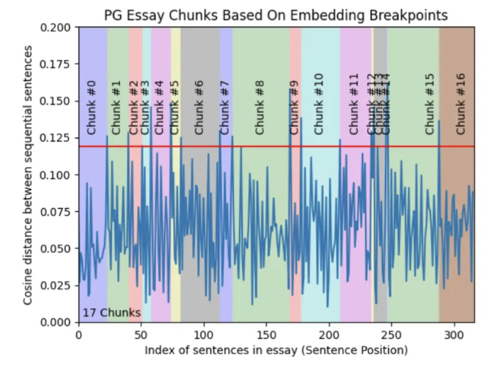
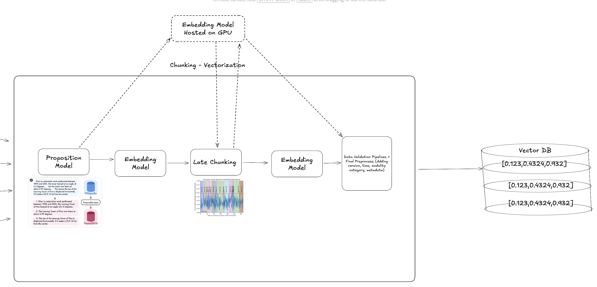

# RAG Boilerplate 


[🎥 Watch the demo on Vimeo](https://vimeo.com/1133081881)


Read README_SYSTEM_DESIGN.md for system design overviews.
Read src/chunking/README.md to see chunking pipeline on action.

A RAG system that is :

- Chunking with propositional model + late chunking, and simple recursive overlap retrieval
- Using Qdrant as a Vector DB, utilising its hybrid search (BM25 + Dense Search)
- Reranks via LLMs
- Using query enhancement agent via LLMs
- Using crewAI for conversation+retrieval agent
- Allows you to chat with data
- Dividing conversations into sessions, saving/caching in Redis, cold stage to MongoDB
- Having simple GUI on Gradio
- Creates evaluation data specialised in hit rate, that allows to compare different retrieval combinations (with/without reranker/query enhancer)

# Table of Contents

- [RAG Boilerplate](#rag-boilerplate)
- [Table of Contents](#table-of-contents)
    - [How to run](#how-to-run)
      - [Container Ports \& Services](#container-ports--services)
    - [Python Project Template](#python-project-template)
    - [Python/Package Manager](#pythonpackage-manager)
    - [Database Choice](#database-choice)
    - [Data Parsing \& Ingestion System](#data-parsing--ingestion-system)
      - [📊 Progress Tracking Metrics](#-progress-tracking-metrics)
      - [📋 Legacy Comparison](#-legacy-comparison)
    - [Vector DB](#vector-db)
    - [Embedding](#embedding)
    - [Vector DB — Vector Index Decision](#vector-db--vector-index-decision)
      - [Zilliz / Milvus Strategy](#zilliz--milvus-strategy)
      - [Heuristic to Use Index](#heuristic-to-use-index)
      - [Assumptions for Estimation](#assumptions-for-estimation)
    - [Tech Stack Alternatives](#tech-stack-alternatives)
      - [Qdrant + Redis + MongoDB](#qdrant--redis--mongodb)
      - [Qdrant (or other) + Elasticsearch + MongoDB](#qdrant-or-other--elasticsearch--mongodb)
      - [Elasticsearch + MongoDB](#elasticsearch--mongodb)
      - [PostgreSQL + pgvector (+ optional Redis)](#postgresql--pgvector--optional-redis)
    - [Chunking Strategy](#chunking-strategy)
      - [1. Proposition Model :](#1-proposition-model-)
      - [3. Final Embedding:](#3-final-embedding)
    - [Chat Agent](#chat-agent)
    - [Retriever](#retriever)
      - [Query Enhancement](#query-enhancement)
    - [Tech Stack for Session Management](#tech-stack-for-session-management)
      - [Side stack, educational purposes, Redis Express, Mongo Express UI.](#side-stack-educational-purposes-redis-express-mongo-express-ui)
    - [Ingestion](#ingestion)
    - [Hybrid + Vector Search](#hybrid--vector-search)
    - [Reranking](#reranking)
    - [Evaluation](#evaluation)
    - [Codebase Design Patterns](#codebase-design-patterns)
    - [APIs](#apis)
      - [API Endpoints](#api-endpoints)
    - [What should be done in production](#what-should-be-done-in-production)
  - [TO-DO](#to-do)


Tech Stack (Component Responsibilities): 

- FastAPI : Serving 
- Redis : Cache layer of conversations, hot stage to retrieve data
- MongoDB : Cold stage database to keep TTL exceeded conversation, also storage of static data (evaluations, etc.)
- crewAI : Agentic AI solution to easily deal with multi-step agents
- Qdrant : A Vector DB that allows to do hybrid search natively (BM25+Dense)
- Celery : Distributed task management for the long data ingestion projects
- Gradio : Quick-n-dirty UI
- HF : Embedding/Proposition Models
- LLM : ChatGPT-4o-mini (you can set anything)
- And redis express and mongo UI for educational purposes, normally I don't use them but they're easier to setup than MongoDB Atlas.
   

### How to run

Fill up .env.example and rename it to the .env .

```
git clone https://github.com/mburaksayici/legal-rag.git && \
cd legal-rag 

docker-compose up -d

```

Optionally, you can install EURLEX data and preprocess to mock PDFs via the code below.  
```
uv venv --python 3.10 && \
source .venv/bin/activate && \
uv pip install reportlab python-dotenv && \
python -m src.assets.prepare_eurlex --no_docs 300 && \
mkdir -p assets/sample_pdfs && \
find assets/pdfs -type f -name '*.pdf' | shuf -n 10 | xargs -I{} cp {} assets/sample_pdfs/ 
```


#### Container Ports & Services

After running `docker-compose up -d`, the following services are available:

| Service | Port | Description |
|---------|------|-------------|
| **Gradio UI** | `7860` | Web interface for interacting with the RAG system (chat, retrieval, ingestion, evaluation) |
| **FastAPI App** | `8000` | Main API server (REST endpoints for chat, retrieval, ingestion, etc.) |
| **Celery Worker** | - | Background task processor for document ingestion (no exposed port) |
| **Qdrant** | `6333` | Vector database HTTP API (vector search and storage) |
| **Qdrant** | `6334` | Vector database gRPC API |
| **Redis** | `6379` | Cache and session storage, Celery message broker |
| **MongoDB** | `27017` | Persistent database for sessions and evaluation data |
| **Redis Commander** | `8081` | Web UI for Redis management (educational/admin tool) |
| **Mongo Express** | `8082` | Web UI for MongoDB management (educational/admin tool) |

**Quick Access:**
- 🌐 **Gradio UI**: http://localhost:7860
- 📡 **FastAPI Docs**: http://localhost:8000/docs
- 🔍 **Redis UI**: http://localhost:8081
- 🗄️ **MongoDB UI**: http://localhost:8082

### Python Project Template 

I use different templates time to time to start with, for this one I'll give [ Netflix's Dispatch project structure](
https://github.com/zhanymkanov/fastapi-best-practices) a try. 


Side Note :

I generally use  [FastAPI's official template.](github.com/tiangolo/full-stack-fastapi-template)

Or if I foresee the project requirements (eg. if I know I use redis+celery+flask I search for a specific combo), I research on templates to start with.

### Python/Package Manager

Throughout history I've used plain pip, poetry, pdm. uv got its fame for a reason, uv is used on the project and I'm glad I've used especially on Silicon Mac.

### Database Choice
Why did project pick Mongodb over SQLs and others?

MongoDB, since it's flexible for a small project, especially when requirements are not clear. Project deals with text data, any NoSQL should be a go for a prototype.

Side (Fun) Note : When I was working on a startup, an experienced guy joined to the project, he taught me a lesson that project needs to be migrated to PostGres due to business requirements of database migrations (PGres handles natively), **but he said he's not recommending  that to the technical team since he joined 1 week ago, he said it's not the correct time**.  

### Data Parsing & Ingestion System

How did system handles ingestion jobs?

In that scale, celery is a to-go for long ingestion tasks, and its compatibility with Redis made me think to use Redis as in-mem cache of conversations. 

An ingestion endpoint starts a job with job id, celery runs on workers, reporting the status to the MongoDB. Webapp can poll result.


Although I didn't use redis pub/sub or celery signals, they can be used to inform end users.


#### 📊 Progress Tracking Metrics

- Total documents to process
- Documents processed so far
- Successful vs failed document counts
- Current file being processed
- Estimated time remaining
- Progress percentage
- Real-time status updates


#### 📋 Legacy Comparison

| **Category** | **API Solutions** | **Custom Solutions** |
|---------------|-------------------|----------------------|
| **Description** | High-quality baseline; no constraint on budget | Necessary in some domains; customizable pipelines |
| **Tools / Examples** | LangChain Parse, MinerU | LangChain, PyMuPDF, Unstructured, Docling |
| **Cost** | ~0.0001¢ per page (basic parsing) | Free (except man-hours) |
| **Pros** | High accuracy, easy setup | Custom logic, domain adaptability |
| **Cons** | Cost increases with scale | Higher engineering effort |


### Vector DB
Qdrant is employed on the project. Simple reasons are native support for hybrid search.

Why Qdrant, not FAISS, Chroma, pgvector?  Tradeoffs?


Previously have used ChromaDB local, Pinecone Cloud. 

**For the project, I have changed DB choice 3 times because:**

1. First attempted Milvus, because I love his CTO, he moved to VoyageAI later on and then company acquired by MongoDB. However I've read it has limited capability on free-oss tier.
2. Switched to ChromaDB for local tests, was about to keep it until I hit to celery task deadlocks reading from local disk which is obvious.
3. Want to test hybrid/fusion scoring that combines BM25 + dense search, Qdrant offers that, so I set up a standalone Qdrant container. 


- **Scaling:** Use APIs when you don’t want to deal with scaling. For small projects, a self-hosted setup can be sufficient.  

Side (Fun) Note: I'm still waiting for **MongoDB** to release full **Vector DB** functionality for on-premise use. At the moment, it’s only available in their Atlas Vector DB (cloud version). IDK why they have been inactive for so long. Now they acquired Voyage AI, joined Frank Liu and Terence Tao, both amazing guys. 


### Embedding 

Which one and why?

I'm sad that I discovered [voyage-law-2](https://www.youtube.com/watch?v=pIPtpBZ6TKk) model very late. I'm a big fan of Frank Liu, I haven't seen the talk yet. However, model is [on HF, but weights not available](https://huggingface.co/voyageai/voyage-law-2
) and available [via API.](https://aws.amazon.com/marketplace/pp/prodview-bknagyko2vl7a)


Both Langchain CEO and Milvus/VoyageAI (Frank Liu again) CTO advises E5, especially Frank Liu advises it multiple times. 

Performance concerns, I'll go with E5-small. 

[MTEB Leaderboard](https://huggingface.co/spaces/mteb/leaderboard) should be followed for embedding for different purposes. Some models are good at reranking while some are in retrieval.

In a specific legal docs example, repetitive terms/domain-specific language usage may make the life of general models harder. Probably, legal embedding models are trained via negative sampling on daily usage, and positive sampling on a legal document usage. 

On the other hand, vagueness due to repetitive propositions are solved via propositional model, during chunking process.


Note project also implements evaluation pipeline so different embedding models can be tested later on, and embedding could be parametrized in retrieve endpoints..


### Vector DB — Vector Index Decision

#### Zilliz / Milvus Strategy

Milvus (by Zilliz) recommends choosing a **vector index** based on data size and recall requirements. The index type determines search speed, accuracy, and memory efficiency.

---

#### Heuristic to Use Index

| Data Size | Recommended Index Type | Description |
|------------|------------------------|--------------|
| 100% recall / accuracy | **Brute-force (FLAT)** | Exact nearest neighbor search, slow but precise |
| 10 MB – 2 GB | **Inverted File (IVF)** | Efficient for small-to-medium datasets |
| 2 GB – 20 GB | **Graph-based (HNSW)** | Fast and memory-efficient for mid-scale datasets |
| 20 GB – 200 GB | **Hybrid (HNSW_SQ, IVF_PQ)** | Balances accuracy and compression |
| 200 GB+ | **Disk-based (DiskANN)** | Optimized for large-scale vector data stored on disk |

I'll use the database default, HNSW, will work as good as FLAT on small data.

#### Assumptions for Estimation

* **1 PDF = 10 pages**
* **1 page = 500 words**
* **15 words = 1 sentence**
* **1 chunk = 3 sentences**
* **1 PDF = 111 chunks**

Thus,

* **1 chunk = 512 × 2 = 1 024 bytes ≈ 1 KB (float16)**
* **1 PDF = 111 × 1 KB = 111 KB**
* **100 k PDFs = 11 GB**

Could be a rough estimate to choose indexing.

Those assumptions lead to:

| PDFs    | Pages per PDF | Words per Page | Total Words | Chunks (= Words / 45) | Size per Vector | **Total Size (fp16)** | **Total Size (fp32)** |
| ------- | ------------- | -------------- | ----------- | --------------------- | --------------- | --------------------- | --------------------- |
| 1 000   | 10            | 500            | 5 M         | 111 111               | 1 KB            | ≈ **0.11 GB**         | ≈ 0.22 GB             |
| 5 000   | 10            | 500            | 25 M        | 555 555               | 1 KB            | ≈ **0.56 GB**         | ≈ 1.1 GB              |
| 50 000  | 10            | 500            | 250 M       | 5.56 M                | 1 KB            | ≈ **5.6 GB**          | ≈ 11.1 GB             |
| 500 000 | 10            | 500            | 2.5 B       | 55.6 M                | 1 KB            | ≈ **55.6 GB**         | ≈ 111 GB              |


### Tech Stack Alternatives

The project can be written in various combinations.

Project requires : 

- Conversation caching
- Document caching
- Vector DB
- Persistent DB for users/roles etc.

There are options, some  may bloat your tech stack but may bloat it for a reason, some tech stack is simple enough with less headache. 

For such a project, those are the general options I've seen people are using successfully. 


#### Qdrant + Redis + MongoDB

- **Qdrant** → Vector Database (stores embeddings and enables semantic search)  
- **Redis** → Cache for chat history, conversation context, and asynchronous task results  
- **MongoDB** → Persistent storage for sessions, documents, and chat logs  
- **FastAPI** → Backend framework for API endpoints  
- **Celery** → Task queue for background ingestion and embedding jobs  


#### Qdrant (or other) + Elasticsearch + MongoDB

- **Qdrant (or other)** → Vector Database  
- **Elasticsearch** → Keyword + hybrid search (BM25) and optional caching layer for query results  
- **MongoDB** → Persistent storage for metadata and history  
- **FastAPI** → API layer  
- **Celery / RQ / Dramatiq** → Asynchronous job management  


#### Elasticsearch + MongoDB

- **Elasticsearch** → Both Vector + Keyword Search + Caching (short-TTL indices)  
- **MongoDB** → Persistent DB for sessions, chat, and documents  
- **FastAPI** → Backend service  
- **Celery / RQ / Dramatiq** → Async document ingestion and processing  


#### PostgreSQL + pgvector (+ optional Redis)

- **PostgreSQL (pgvector)** → Combined structured DB + vector embeddings storage  
- **Redis (optional)** → Cache for chat states and async job results  
- **FastAPI** → API service  
- **Celery / RQ / Dramatiq / BackgroundTasks** → For background jobs  


For the sake of simplicity+flexibility I'll go with Qdrant + Redis + MongoDB but I've heard complaints about Redis on big scales.

Depending on the needs you can switch to other tech stack.

### Chunking Strategy 

Chunking consists of three nodes:

#### 1. Proposition Model : 

Embedding models like diversity on the data, and got confused on the pronouns, I'm guessing especially in legal documents cases.




The proposition has such an effect on EUR-LEX data : 

| Original Sentence | Rewritten / Equivalent Sentence |
|--------------------|---------------------------------|
| **_`Having received`_** an Opinion from the Commission. | **_`The Council shall receive`_** an Opinion from the Commission. |

In src/data_preprocess/README.md, I'm leaving the full example.


#### 2. Late Chunking via Sequential Sentence Embedding Differences

Milvus and Langchain technical executives both advices Late Chunking. And I've seen the technique that, 

a. given the sentence embeddings provided by propositioner, calculating embeddings for each sentence
b. then cosine similarity Splitting to find semantic boundaries
c. Finding breakpoint on difference jumps, meaning "there is a context change". 
d. Grouping till the parts of chunks.




With that way, pipeline checks if meaning shift between sentences exists. 

#### 3. Final Embedding: 

Since the new chunks arrived, a final embedding is applied to save to vector DB.


You can get into the [./src/data_preprocess/README.md](src/data_preprocess/README.md) on a real example of a full pipeline, step by step. I highly suggest that!


Final chunking stragegy looks like:




### Chat Agent

As a framework for thinking/orchestrating AI agents I want to experiment CrewAI.

I've written my own pipelines myself 2 years ago, I've used celery+own implementation on agents at career.io/interview-prep . Tested  but didn't like Langchain 1 year ago for different project. 

At the end of the day they are extension of api-wrappers, nothing wrong with writing 2-3 step agents by yourself but when agents have multistep, orchestration could be better. 

Prompt templating on MongoDB and letting PMs to modify prompts is also a good choice for experimenting, leaving polishing to PMs. 


### Retriever

Automergingretrieval is used, heavily advised by Langchain/Milvus.


All the alternatives, recursive retrieval, parent-child retrieval and similar others, lyes on the principle of "if so many chunks from same section, why not getting the full section" logic.

Which makes sense!

#### Query Enhancement

Before the retrieval layer, query enhancement is applied. 


### Tech Stack for Session Management 
Considerations:
- Reads will be dominant.
- Conversation retrieval should be quick.
- Conversation retrieval can be needed both by backend and frontend.


a. Redis : To keep latest conversations/sessions in-memory and quick recovery.

b. Mongodb : Persistent (Cold Stage) DB to:
1. Retrieve unused conversation from mongodb to redis, if conversation is reinstantiated
2. Store conversations and other related artifacts (redis keys) which are cache invalidated due to TTL (6 hours, 1 business day, 1 week)


c. Celery : To orchestrate TTLs from redis to mongo.

Pattern : Cache Aside Pattern

App <-> Redis <-> MongoDB 


                       ┌──────────────────────────┐
                       │          App             │
                       │ (Backend / Frontend)     │
                       └────────────┬─────────────┘
                                    │
                     1️⃣  Read / Write Request
                                    │
                                    ▼
                       ┌──────────────────────────┐
                       │         Redis            │
                       │   (Cache - in memory)    │
                       └────────────┬─────────────┘
                         ▲          │
       3️⃣ Rehydrate on   │ 2️⃣ Cache Miss → Query DB
          reinstantiation│          ▼
                       ┌──────────────────────────┐
                       │        MongoDB           │
                       │ (Persistent Storage)     │
                       └──────────────────────────┘


#### Side stack, educational purposes, Redis Express, Mongo Express UI.

To test if conversation in redis

'
GET session:0ea95f3a-b0ab-4e2e-92d8-6e227fd7715f

TTL session:0ea95f3a-b0ab-4e2e-92d8-6e227fd7715f
'


Mongodb Atlas (heavily used it before, quite liked it) can be used for tracking, but for simplicity I wanted to use Mongo Express UI.


### Ingestion 

1. Fastapi triggers celery, given the folder. 
2. Celery creates number of tasks per file. 
3. Ingest/status api to track status of a job. 

Celery runs on different container, using redis as broker. Same redis (not same queue) used to carry the messages.

Docling is used in pdf pipeline, so it's slow for a moment.

### Hybrid + Vector Search

As explained in Vector DB section, Qdrant offers the capability of the search. Although local implementations are pretty easy/customizable, it may not be scalable for big data.

### Query Enhancer 

"Why Snowflake stocks are down?" , could be a question for a financial RAG system, as I've faced at [Financial RAG Project](https://github.com/mburaksayici/FinancialAdvisorGPT/). 

An agent that does Google Search or searching the news, couldn't find anything within the first hours. User's query needs to be converted into 

- "snowflake stock down reason"
- "snowflake breaking news"

That would give you the reason : [Slootman, CEO of Snowflake has retired.](https://www.investopedia.com/snowflake-stock-plunges-after-company-names-new-ceo-issues-disappointing-guidance-8601946)

For the reason I added query enhancer with Crew AI. 

### Reranking

The reason RAG projects require reranking:

- Embedding models trained to find similarity between queries->answers, sometimes text<->text . This doesn't mean retrieved documents are answering to the query.  
- Embedding models, by their nature, aggregates query tokens, embeds them into [no_token, embedding_size], then aggregates into single vector by pooling or etc. 
- Aforementioned practise allows Vector Search to retrieve similar docs (and if you think carefully, distinct feature between sparse methods such as TF-IDF), however, compressed embeddings loses a. relation between tokens b. Time series features of a text.
- LLMs on the other doesn't compress token into single vector dimension, read it all and read it sequentially, preserving historical meaning.

In small systems, like I used in career.io/interview-prep was similar to simple BM25 + LLM reranking.

There are reranker models trained for that purpose, depending on the cost+performance tradeoffs you can either use reranker model or use simple LLMs. 

For the project I created reranking agent that retrieves documents, feeds into LLM. It's a parameter of retrieve function.

The endpoint to test, is the "retrieve" endpoint that you can toggle on-off the reranking and query enhancer.

### Evaluation 

For now, easiest way to evaluate without complex system, since I have shallow pdfs:

1. Created one question per pdf
2. Using existing retrieve function, --beware I didn't run it on end result-- 
3. Match if same pdf files are hit, giving me hit rate @ k. Calculate MRR on the order again check if retrieved pdf = relevant pdf.


I may fix the logic later on, calculate matching on chunks rather than matching file paths, but since I have 1-2 pages of docs I thought it'll be fine for now. 

Normally, I should record every file in mongodb, save ids of chunks, when I get the question from data loading pipeline I would need to save chunk_id  and match retrieved chunk id = relevant chunk id.

Note : I've written extensive blog on [evaluation pipelines](https://mburaksayici.com/blog/2025/10/12/information-retrieval-1.html).


### Codebase Design Patterns 

- [Abstract Factory Classes](https://refactoring.guru/design-patterns/abstract-factory/python/example) : To standardise multiple pipelines, such as both DataPreprocessSemantic and SimplePDFPreprocess  uses DataProcessBase, that enforces to use certain parameters. I may have to enforce typing for input/output but I didn't at that stage, since they're subject to change. 

- Pydantic schemas bw components that I want to standardise input/outputs

- Factory methods, assuming that all methods imported having same i/o format, choosing from various method via only factory[method_name] seems beneficial.

- I like the Netflix project structure, that decouples the  router logic and service layer of different modules. For now I kept all routers in src.routers, however for sessions I used src.sessions.routers , which looks better, and I should change to that format. 

- Generally, I followed the pattern of : 


Service Layer → Application Layer → Factory Method → Interface → Abstract Base Class

- Having this, I can modify changes on payloads on service layer. If module use another module, it calls the implementation in another application layer, not from service. 

- Compostion over inheritence, generally. 


### APIs


#### API Endpoints

Detailed i/o docs are within the src.posts.routers. 

All routes are organized in `src/posts/router.py` and `src/sessions/router.py` for clean architecture:

| Endpoint | Method | Description |
|----------|---------|-------------|
| `/chat` | POST | Chat with AI assistant |
| `/sessions` | GET | List all sessions |
| `/sessions/{session_id}` | GET | Get session information |
| `/retrieve` | POST | Test document retrieval |
| `/ingestion/start_job` | POST | Start folder ingestion job |
| `/ingestion/start_single_file` | POST | Start single file ingestion |
| `/ingestion/status/{job_id}` | GET | Get job progress and status |
| `/ingestion/jobs` | GET | List all active jobs |
| `/evaluation/start` | POST | Start evaluation job |
| `/evaluation/{evaluation_id}` | GET | Get evaluation results |
| `/evaluations` | GET | List all evaluations |
| `/assets/list` | GET | Browse assets directory |


### What should be done in production


- Security : 


  1. To manage sessions, I've used JWT with expiry times on previous projects. 
  2. Same JWT could be used in websocket streaming as well. 
  3. Django could be a nice choice although I havent fresh start a project with it, I know it has pre-implementations. 
  4. Role management should be implemented on mongo to decide user-session/team-sessions and which document to be retrieved by whom. The layer should also be limiting agents to access the data. 

- Scalability Concerns : 
  
  1. Rare issue :  OpenAI via same api-key easily hits rate limit as I've faced before. Talking to service provider beforehands.
  2. Data pipelines/embeddings inside celery is actually not wise. I would be having another machine (gpu) on Runpod for example as I've used before, and writing grouping function for different requests, batching and redistributing vectors to the correct devices. Or, machine(gpu) would batch infer the embeddings, place to redis with request_id, and app layer would grab that.
   
  3. I've heard redis is known as having problems on big scale. I've never worked on that scale but people using others.
  4. Classical DB scaling concerns to replicate MongoDB etc.

- Monitoring : 
    1. At least grafana to monitor services, but its dead slow but cheap. 
    2. LLM logging, we were hacking sentry to do visualise efficiently but I need to research on best LLM monitoring tool
    3. Sentry or Newrelic or again simple grafana to log failures/code issues
   

- Cost Optimizations : 
  1. Test agents on small models. Test if stupid tasks can be done via 4o-mini or any other cheaper task. Especially the routing tasks. 
  2. Reranking via reranker models if scale is big, if data scale is small cheap LLM models could be less costly.
  3. In my previous experiences, if LLM usage is high and throughput is not expected, hosting LLMs are lot cheaper than apis. Cases include using LLMs to preprocess data lakes. We were able to reduce ChatGPT costs from 40k$ to 5k$ with finetuning small language models, also using ChatGPT as a fallback. 


## TO-DO

- [ ] Qdrant hybrid search  
- [ ] Document-specific RAG pipelines  
- [ ] Metadata categorization for document types + include metadata in retrieval-agent prompts  
- [ ] Embedding models on GPU or batched inference  
- [ ] Chunk-based evaluation rather than document-level  
- [ ] Document metadata population in MongoDB  
- [ ] Memory for conversation agents  
- [ ] Chain-of-Thought for conversation / retrieval agents  
- [ ] Agents run as separate services  
- [ ] Improve Redis → MongoDB synchronization  
- [ ] Store conversation sessions in MongoDB  
- [ ] Fusion scoring hyperparameter search for Qdrant hybrid search  
- [ ] Metadata registry inside retrieval-agent prompt window  
- [ ] Evaluation pipeline runs as a background task (Celery / worker)

